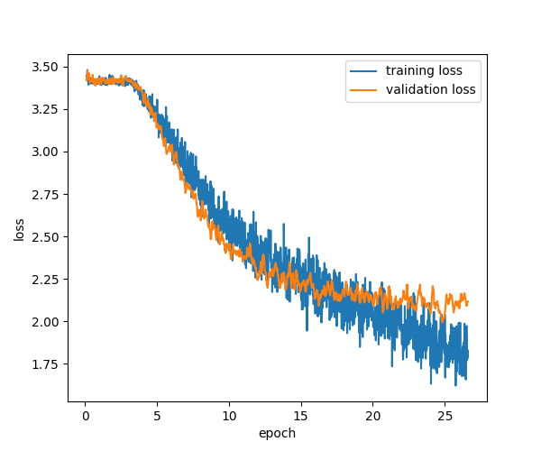
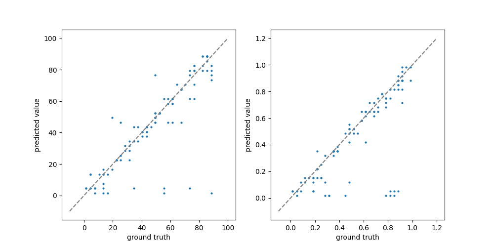

# Asteroseismology

Estimate the inclination angle from the spectrum

## Requirement

- Python 3.8+

Install the following libraries with `pip`.
- torch==1.12.0
- torchvision==0.13.0
- torchinfo
- torchhk
- torchbnn
- pandas
- seaborn
- scikit-learn
- tqdm
- matplotlib

## How to Run

- Put your training and validation data (e.g., 0000000.0.data, Combinations.txt) at `./training_data` and your test data at `./test_data`

- Create a normalization parameter file at `param` with two columns corresponding `xmin` and `dx`. 
The input and target data will be normalized as `d = ( d - xmin ) / dx`. 
The first `n_feature` rows corresponds to the input data and the last `len(output_id)` rows to the output. `dx` should be greater than 0.
If you use `nllloss` as the loss function, then the resulting pdf will cover the range \[xmin, xmin + dx\].

- Then run training and test code by 
```
./sub.sh
```

- If you want to train on 2D data, run
```
./sub2.sh
```
You need to set both seq_length and seq_length_2 > 0.

- You can change the parameters in sub.sh. For the output_id, you can choose multiple ids (column number) by, e.g., `python main.py --output_id 1 2 3 --isTrain`.


- After the training, use plot.ipynb to check the model performance. 

Loss function:  
 

Validation output:  
 


You can check the model structure in the output file at `./tmp`


- Input shape: (batch_size, seq_length, len(input_id))

- Output shape: (batch_size, output_dim, len(output_id)) for NLLLoss, (batch_size, len(output_id)) for the other losses


## References


## Known Issues


